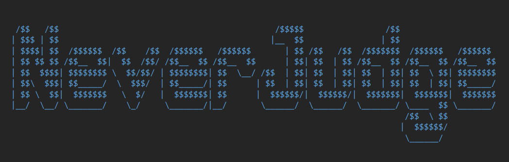

# NeverJudge


<p align="center">Ehh... I hate Judge! </p>

NeverJudge is a simple code editor with Openjudge remote integration, designed for assignments of Practice of Programming in 2025 Spring.

## How to use

### Dependencies

This project uses CMake for building and supports both MacOS and Linux systems, following the C++23 standard.

Necessary dependencies include:

- `Qt6`: Framework used in the project
- `QTermWidget6`: Terminal integration
- `QCoro6`: Qt coroutine support
- `tree-sitter`: Syntax highlighting foundation

Optional dependencies include:

- `tree-sitter-cpp`, `tree-sitter-python`: Syntax highlighting support
- `clangd`, `pylsp`: Language Server Protocol support
- `requests` and `BeautifulSoup` libraries in Python: OpenJudge remote support

### Building

1. Clone the repository:

    ```bash
    git clone https://github.com/LeoDreamer2004/Never-Judge.git
    cd Never-Judge
    ```

2. Execute the following CMake commands in the project root directory:

    ```bash
    cmake . -B build
    cmake --build build
    ```

3. After building, the `NeverJudge` executable will be generated in the `build` directory. You can run it directly.
4. The program configuration files are located in the system's default configuration directory:
   - For Linux: `~/.config/never-judge`
   - For MacOS: `~/Library/Application Support/never-judge`

## Features

- [x] Dynamic detection on code modification
- [x] Icon bar menu
- [x] Preferrence settings
- [x] Openjudge remote and personalization
- [x] Feedback after submissions
- [x] Code running config
- [x] Deepseek Coder AI assistant
- [x] Syntax highlighting (supported by [tree-sitter](https://tree-sitter.github.io/tree-sitter/))
- [x] Bracket matching highlighting (partially implemented, difficult to achieve with current architecture) and quick comment
- [x] Advanced coding analyse with Language Server Procotols (supported by [Clangd](https://clangd.llvm.org/) and [PyLSP](https://github.com/python-lsp/python-lsp-server))

## Documentation

Refer to [report (Chinese)](./doc/report.md) for more information.

See [Bilibili video](https://www.bilibili.com/video/BV1Wy7FzNEF3/) for group presentation.

## License

GNU General Public License v3.0 (GPL-3.0)
