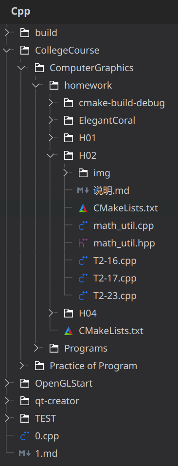

# NeverJudge

原梓轩 2200010825

## 项目简介

本项目 NeverJudge 为一个为方便 OpenJudge 提交的简单代码编辑器。项目使用 C++ Qt6 框架开发。

我们提供了作为编辑器的基本高亮、补全和跳转定义功能，允许用户在项目文件夹下浏览任意非二进制文件。程序中集成了终端，用户可以通过配置项来设置程序的运行指令和参数。我们还设计了一个 AI 接口可视化，来帮助用户更好地使用 AI 进行代码编写和调试。本地测试完成后，我们还提供了一个 OpenJudge 的远程提交功能，用户可以在登录后直接提交代码到 OpenJudge 上。

## 构建与运行

### 项目依赖

本项目使用 CMake 构建，支持 MacOS 和 Linux 系统，并遵循 C++23 标准。

必要依赖为：

- `Qt6`：项目使用框架
- `QTermWidget6`：终端集成
- `QCoro6`：Qt 协程支持
- `tree-sitter`：语法高亮基础

可选依赖为：

- `tree-sitter-cpp`，`tree-sitter-python`：语法高亮支持
- `clangd`，`pylsp`：语言服务器协议支持
- `python` 的 `requests` 库和 `BeautifulSoup` 库：OpenJudge 远程提交支持

### 构建

在项目根目录下执行以下 CMake 命令：

```bash
cmake . -B build
cd build
make
```

编译完成后，`build` 目录下会生成 `NeverJudge` 可执行文件，直接运行即可。程序配置文件在系统默认配置目录下，Linux 为 `~/.config/never-judge`，MacOS 为 `~/Library/Application Support/never-judge`。

## 功能展示

### 文件树



利用 `QFileSystemModel` 可以方便地展示文件树，我们借此实现了一个简单的文件浏览器。用户可以在文件树中浏览任意文件，点击文件后会在右侧的编辑器中打开该文件。我们也提供了一个右键菜单，可以创建、打开、删除和重命名文件，并给这些操作绑定了快捷键。

### 终端集成


`QTermWidget` 提供了 Qt 的终端 API，我们把它加入到项目当中，并作为可折叠的内容嵌入到窗口内。我们在设置项中读取了当前计算机所有终端主题，用户可以根据喜好选择并进行（热）更新，终端的输入输出都可以在窗口内查看。

### 运行配置

为了多样化地运行程序，我们提供了一个运行配置的设置项，用户可以在其中设置程序的运行指令和参数。为了方便用户使用，我们预先定义了几个宏：

- `$dir`：当前文件目录

### OpenJudge 远程

### 代码高亮

### 语言服务器协议

### AI 接口

## 特点

### 前后端解耦

### 协程机制
