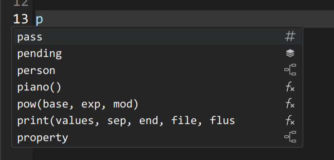

# 程序设计实习大作业报告——Never Judge

## 项目简介

本项目名为 Never Judge，是一个为方便 OpenJudge 提交的简单代码编辑器。项目使用 C++ Qt6 框架开发。

作为代码编辑器，我们为这个程序设计了代码高亮、补全和跳转定义功能，允许用户在项目文件夹下浏览任意非二进制文件。程序中集成了终端，用户可以通过配置项来设置程序的运行指令和参数。我们还设计了一个 AI 接口可视化，来帮助用户更好地使用 AI 进行代码编写和调试。本地测试完成后，我们提供了 OpenJudge 的远程提交功能，用户可以在登录后直接提交代码到 OpenJudge 上。

**小组分工**：

- 原梓轩 2200010825 数学科学学院：项目框架搭建和绝大多数功能实现
- 吴杰稀 2300015897 光华管理学院：OJ 个人设置功能、小组视频剪辑
- 许畅 2300015869 信息科学与技术学院：AI 接口可视化

项目代码详见 [GitHub 仓库](https://github.com/LeoDreamer2004/Never-Judge)，演示视频详见 [Bilibili](https://www.bilibili.com/video/BV1Wy7FzNEF3/)。

   

## 构建与运行

### 项目依赖

本项目使用 CMake 构建，支持 MacOS 和 Linux 系统，并遵循 C++23 标准。

必要依赖为：

- `Qt6`：项目使用框架
- `QTermWidget6`：终端集成
- `QCoro6`：Qt 协程支持
- `tree-sitter`：语法高亮基础

可选依赖为：

- `tree-sitter-cpp`，`tree-sitter-python`：语法高亮支持
- `clangd`，`pylsp`：语言服务器协议支持
- `python` 的 `requests` 库和 `BeautifulSoup` 库：OpenJudge 远程提交支持

### 构建

在项目根目录下执行以下 CMake 命令：

```bash
cmake . -B build
cmake --build build
```

编译完成后，`build` 目录下会生成 `NeverJudge` 可执行文件，直接运行即可。程序配置文件在系统默认配置目录下，Linux 为 `~/.config/never-judge`，MacOS 为 `~/Library/Application Support/never-judge`。

## 功能展示

关于完整的功能展示视频，请参看 [Bilibili](https://www.bilibili.com/video/BV1Wy7FzNEF3/)。

### 文件树

利用 `QFileSystemModel` 可以方便地展示文件树，我们借此实现了一个简单的文件浏览器。效果详见下方的配置文件配图。

用户可以在文件树中浏览任意文件，点击文件后会在右侧的编辑器中打开该文件。我们也提供了一个右键菜单，可以创建、打开、删除和重命名文件，并给这些操作绑定了快捷键。

### 终端集成


`QTermWidget` 提供了 Qt 的终端 API，我们把它加入到项目当中，并作为可折叠的内容嵌入到窗口内。我们在设置项中读取了当前计算机所有终端主题，用户可以根据喜好选择并进行（热）更新，终端的输入输出都可以在窗口内查看。

### 运行配置

为了多样化地运行程序，我们提供了一个运行配置的设置项，用户可以在其中设置程序的运行指令和参数。为了方便用户使用，我们预先定义了几个宏：

- `$dir`：当前文件目录
- `$filename`: 当前文件名
- `$filenameNoExt`: 当前文件名（不含扩展名）

以 Python 配置为例: `cd $dir && python $filename`, 即可在当前文件目录下运行 Python 文件，实质上在终端执行的指令如下所示。


### OpenJudge 远程


我们实现了 OpenJudge 远程集成功能，用户可以：

1. **浏览题目**：通过输入题目链接或比赛链接，可以直接在编辑器中浏览题目内容，支持对题目进行批量下载
2. **账号登录**：支持用户账号登录，可选择是否记住账号信息
3. **个人信息**：用户可以在设置中配置 OpenJudge 个人信息，例如昵称、简介、生日等平台信息
4. **代码提交**：直接在编辑器中编写代码并提交到 OpenJudge 平台
5. **结果反馈**：实时获取提交结果（AC/WA/CE等状态）并显示反馈信息

远程提交使用了自定义的爬虫系统，通过 Python 脚本与 OpenJudge 平台交互，确保提交过程安全可靠。


### 代码高亮和补全


代码高亮功能基于 [tree-sitter](https://tree-sitter.github.io/tree-sitter/) 实现, 支持 C/C++、Python 语言，且代码扩展性好，依赖安装完成后即可简单调整代码支持其它语言。其中语义高亮规则完全可自定义，请参考 [默认配置文件](../res/setting/settings.json) 的 `highlightRules` 的表项。例如如下的配置项即可实现注释高亮为绿色斜体：

```json
 {
    "pattern": "(comment) @comment",
    "foreground": "#7AA965",
    "style": "italic"
}
```

我们支持了括号匹配，可以自动匹配并高亮对应的括号对。囿于架构所限和性能考虑，跨行的括号匹配不能保证完全正确。

我们支持快捷注释和取消注释功能，即一般 IDE 常用的 `Ctrl+/` 快捷键。注释和取消注释会根据当前语言的语法规则自动添加或删除注释符号。

我们还实现了基于 **语言服务器协议 (Language Server Protocol, LSP)** 的代码智能服务。LSP 是一个对一般语言都通用的协议，只不过不同语言需要不同的服务器实现。我们采用的是 [Clangd](https://clangd.llvm.org/)(C++) 和 [PyLSP](https://github.com/python-lsp/python-lsp-server)(Python)，实现上只需要继承基类，依然保持着良好的代码扩展性。

LSP 允许编辑器与语言服务器通过 JSON 格式进行通信，大致类似于如下形式：

输入：

```json
{
    "jsonrpc": "2.0",
    "method": "textDocument/completion",
    "params": {
        "textDocument": {
            "uri": "file:///path/to/file.cpp"
        },
        "position": {
            "line": 10,
            "character": 5
        }
    }
}
```

输出：

```json
{
    "jsonrpc": "2.0",
    "id": 1,
    "result": [
        {
            "label": "myFunction",
            "kind": 3,
            "detail": "void myFunction()",
            "insertText": "myFunction()"
        },
        {
            "label": "myVariable",
            "kind": 6,
            "detail": "int myVariable",
            "insertText": "myVariable"
        }
    ]
}
```

其中 `label` 是补全的文本，`kind` 是补全的类型（如函数、变量、类名等），`detail` 是详细信息，`insertText` 是插入到编辑器中的文本，由此即完成对代码请求的查询。我们在补全时会根据补全的类型给予不同的图标提示。



LSP 客户端通过与 `clangd`（C/C++）或 `pylsp`（Python）语言服务器通信，为不同语言提供统一的智能编辑体验。

### AI 接口


我们设计了 AI 编程助手功能，基于 DeepSeek Coder 模型，用户设置 API 后，可对当前题目进行算法思路和考点分析，生成完整可运行的示例代码，包含详细注释分析用户代码中的问题并提供修复建议，以及解答用户关于编程的各类问题。我们支持从 AI 的回答中提取代码并插入到代码中的功能，大大提高编程效率。

## 特点

### 前后端解耦

项目采用了前后端解耦的设计模式。界面组件 (`widgets`) 与核心功能 (`ide`)、网络功能 (`web`) 分别实现，利用这种模块化设计，各功能模块可独立开发和测试。数据流驱动上，我们使用信号槽机制实现组件间通信，避免紧耦合，这种设计使得项目结构清晰，便于维护和扩展。

### 协程机制

项目广泛使用了 C++20 协程机制，结合 QCoro6 库，实现了异步操作的同步写法：

- **网络请求**：使用协程处理 HTTP 请求，避免回调地狱
- **文件操作**：异步读写文件，不阻塞主线程
- **外部进程**：协程方式调用 Python 脚本，简化交互流程

通过异步操作可以防止进程阻塞，保持 UI 界面的响应性，提升用户体验。同时协程机制也使得异步编程变得简单直观，代码逻辑清晰，易于理解和维护，避免了重复的嵌套回调代码。

```cpp
QCoro::Task<void> MyClass::runProcess() {
    something_before_process();
    QProcess *process = new QProcess(this);
    co_await qCoro(process).start("python", {"script.py"}); 
    something_after_process(); // 不必用槽函数回调
}
```

## 总结

NeverJudge 是一个功能丰富的代码编辑器，集成了 OpenJudge 远程提交、AI 助手、代码高亮和补全等功能。项目采用了前后端解耦的设计模式和协程机制，使得代码结构清晰，易于扩展和维护。

我们团队采用了 git 进行版本控制，所有代码和文档都托管在 GitHub 上，便于协作和代码审查。项目的构建和运行也非常简单，用户只需按照 README 中的说明即可快速上手。

不过，由于时间和精力有限，我们在项目中仍有一些不足之处，例如还可以支持更多一些常用的快捷键和代码 QoL 功能；代码高亮和补全功能仅支持 C++ 和 Python，且性能不够稳定；LSP 是硬编码形式，更多内容应当以插件的形式而非直接固定在程序当中；AI 助手的功能也可以进一步扩展和完善；此外，项目的 UI 设计和用户体验方面还有提升空间。

我们小组作业在路演展示中以 131 票居于第一位，[展示视频](https://www.bilibili.com/video/BV1Wy7FzNEF3/) 在 Bilibili 播放过万，[GitHub 仓库](https://github.com/LeoDreamer2004/Never-Judge) 获得 30+ 星标，表明了大家对我们作业工作的认可。

通过这次小组作业，我们不仅实现了一个实用的工具，也深入理解了现代 C++ 开发的各种技术和设计模式。希望这个项目能为程序设计的同学们提供便利，帮助大家更好地完成编程任务。
